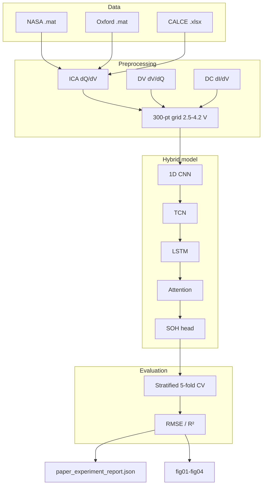

# Battery SOH Paper Reproduction

[](https://doi.org/10.1038/s41598-026-39911-8)
[](https://www.python.org)
[](https://pytorch.org)
[](https://github.com/VamshiKrishnaBandari07/MSc-CAPSTONE-PROJECT-SOH-RUL-PREDICTION--/actions/workflows/ci.yml)
[](LICENSE)

Reproduction of the hybrid deep learning model for lithium-ion **state-of-health (SOH)** estimation (Rahman et al., *Scientific Reports*, 2026).

| | |
|:---|:---|
| **Author** | [Vamshi Krishna Bandari](https://github.com/VamshiKrishnaBandari07) |
| **Programme** | MSc Artificial Intelligence, University of Roehampton (UK) |
| **Repository** | https://github.com/VamshiKrishnaBandari07/MSc-CAPSTONE-PROJECT-SOH-RUL-PREDICTION-- |

---

## Summary for examiners

| Item | Status |
|:---|:---|
| Paper methodology (ICA/DV/DC, 300-pt grid, hybrid model, 5-fold CV) | Implemented |
| **Three datasets** (NASA, Oxford, CALCE) | Full paper experiment in JSON |
| Oxford SOH RMSE vs published **0.021** | **0.0215 ± 0.0050** (aligned) |
| NASA SOH RMSE vs published **0.021** | **0.0385 ± 0.0048** (not matched; ~Transformer 0.038) |
| Figures | `results/figures/fig01`–`fig04` |

> **Methodology reproduced successfully; exact NASA numerical match was not achieved.** See [`docs/SUPERVISOR_GUIDE.md`](docs/SUPERVISOR_GUIDE.md).

---

## Experimental workflow



---

## Reference

**Rahman et al.** Hybrid deep learning approach for battery state-of-health prediction. *Scientific Reports* **16**, 9871 (2026).  
DOI: [10.1038/s41598-026-39911-8](https://doi.org/10.1038/s41598-026-39911-8)

## Quick start

```powershell
git lfs install
git clone https://github.com/VamshiKrishnaBandari07/MSc-CAPSTONE-PROJECT-SOH-RUL-PREDICTION--.git
cd MSc-CAPSTONE-PROJECT-SOH-RUL-PREDICTION--
git lfs pull
pip install -r requirements.txt
python scripts/verify_setup.py
```

## Paper experiment (all three datasets)

```powershell
python run_paper_experiment.py --require-real --cpu
python scripts/sanitize_paper_report.py
python generate_figures.py
```

Runs **NASA → Oxford → CALCE** with stratified **5-fold CV** (~2–8 h on CPU). Re-running one dataset merges into the existing report (does not delete the others).

## Results (stratified 5-fold CV)

| Dataset | SOH RMSE (mean ± std) | SOH R² |
|:---|:---:|:---:|
| NASA | 0.0385 ± 0.0048 | 0.915 |
| Oxford | **0.0215 ± 0.0050** | 0.951 |
| CALCE | 0.0673 ± 0.0101 | 0.950 |

Source: `results/paper_experiment_report.json` · Plots: `results/figures/`

## Methodology

1. **NASA, Oxford, CALCE** — real data via Git LFS  
2. **ICA / DV / DC** on 300-point voltage grid (2.5–4.2 V), Savitzky–Golay (15, 3)  
3. **CNN → TCN → LSTM → attention** (~0.39M parameters), MSE loss  
4. **Stratified 5-fold CV**, random seed **42**

Details: [`docs/PAPER_METHODOLOGY.md`](docs/PAPER_METHODOLOGY.md)

## Repository layout

```
├── data/                   # NASA, Oxford, CALCE (LFS)
├── experiments/            # loaders, CV, training
├── run_paper_experiment.py # main entry (3 datasets)
├── results/                # JSON + fig01–fig04
├── tests/
└── docs/
```

## Documentation

| Document | Purpose |
|:---|:---|
| [`docs/SUPERVISOR_GUIDE.md`](docs/SUPERVISOR_GUIDE.md) | Examiner verification |
| [`docs/PAPER_METHODOLOGY.md`](docs/PAPER_METHODOLOGY.md) | Paper ↔ code |
| [`docs/RESULTS.md`](docs/RESULTS.md) | Results table |

## Citation

```bibtex
@article{rahman2026hybrid,
  title   = {Hybrid deep learning approach for battery state-of-health prediction},
  journal = {Scientific Reports},
  volume  = {16},
  pages   = {9871},
  year    = {2026},
  doi     = {10.1038/s41598-026-39911-8}
}
```

## License

MIT — see [LICENSE](LICENSE).
