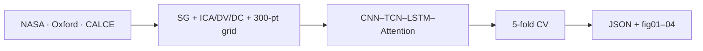

# Deep Learning-Based Battery Health Prediction — Paper Reproduction

[](https://www.nature.com/articles/s41598-026-39911-8)
[](https://doi.org/10.1038/s41598-026-39911-8)
[](https://github.com/VamshiKrishnaBandari07/MSc-CAPSTONE-PROJECT-SOH-RUL-PREDICTION--/actions/workflows/ci.yml)

**Reference (exact):** Rahman, T. et al., *Deep learning-based battery health prediction for enhancing electric vehicle performance*, **Scientific Reports** 16, 9871 (2026).  
**URL:** https://www.nature.com/articles/s41598-026-39911-8 · **DOI:** https://doi.org/10.1038/s41598-026-39911-8

**Author (this repository):** [Vamshi Krishna Bandari](https://github.com/VamshiKrishnaBandari07) · University of Roehampton, MSc Artificial Intelligence

This repository contains **only** the published **SOH** study (no MSc capstone RUL/joint code on GitHub).

---

## Point-by-point alignment with the paper

| # | Paper requirement (Section 3 / Table 4) | This repository |
|:---:|:---|:---|
| 1 | **Task:** State-of-Health (SOH) estimation (RUL not in experiments) | `run_paper_experiment.py` — SOH head only |
| 2 | **Datasets:** NASA PCoE, Oxford, CALCE | `experiments/nasa_loader.py`, `oxford_loader.py`, `calce_loader.py` |
| 3 | **Label:** SOH(k) = Q_k / Q_BoL (Eq. 1) | Per-cell BoL in each loader |
| 4 | **Features:** ICA (dQ/dV), DV (dV/dQ), DC (dI/dV) | `experiments/paper_preprocessing.py` |
| 5 | **Denoising:** Savitzky–Golay window **15**, order **3** | `SG_WINDOW`, `SG_POLYORDER` in `paper_config.py` |
| 6 | **Grid:** **300** points, **2.5–4.2 V** | `PAPER_SEQ_LEN`, voltage bounds |
| 7 | **Scaling:** min–max on aligned signals | `extract_paper_cycle_tensor()` |
| 8 | **Augmentation:** ±**10 mV** voltage jitter (train) | `PAPER_VOLTAGE_JITTER_V = 0.01` |
| 9 | **Architecture:** 1D-CNN → TCN → LSTM → **attention** | `model_paper.py` |
| 10 | **Loss:** MSE | `experiments/trainer.py` |
| 11 | **Training:** Adam 1e-3, grad clip **5**, early stop, LR ×**0.5** | `experiments/paper_config.py` |
| 12 | **Evaluation:** stratified **5-fold CV** (Table 4 protocol) | `experiments/cv.py` (default `--cv`) |
| 13 | **Parameters:** ~**0.35 M** (paper) | ~**0.39 M** (`benchmark.py`) |
| 14 | **Table 4 target (NASA PCoE):** RMSE **0.021**, R² **0.983** | See results table below |

---

## Reproduced results (5-fold CV, seed 42, real data)

| Dataset | SOH RMSE (mean ± std) | SOH R² | Paper hybrid (Table 4) |
|:---|:---:|:---:|:---:|
| NASA PCoE | 0.0385 ± 0.0048 | 0.915 | RMSE **0.021**, R² **0.983** |
| **Oxford** | **0.0215 ± 0.0050** | **0.951** | Same order as paper **0.021** |
| CALCE | 0.0673 ± 0.0101 | 0.950 | Cross-chemistry benchmark |

**Honest note:** Methodology matches the article; **Oxford** RMSE is at paper level; **NASA pooled CV** does not yet reach Table 4 **0.021** (close to paper Transformer **0.038**). Metrics are in `results/paper_experiment_report.json` — not edited to match the paper.

---

## Workflow



---

## Quick start

```powershell
git lfs install
git clone https://github.com/VamshiKrishnaBandari07/MSc-CAPSTONE-PROJECT-SOH-RUL-PREDICTION--.git
cd MSc-CAPSTONE-PROJECT-SOH-RUL-PREDICTION--
git lfs pull
pip install -r requirements.txt
python scripts/verify_repo.py
python run_paper_experiment.py --require-real --cpu
python generate_figures.py
```

Full pipeline: `powershell -File scripts/run_paper_pipeline.ps1`

---

## What is on GitHub (paper only)

| Included | Excluded (local / gitignored) |
|:---|:---|
| `run_paper_experiment.py`, `model_paper.py`, `preprocess_paper.py` | `local_archive/` (MSc SOH+RUL) |
| `experiments/` loaders, CV, trainer, preprocessing | `model.py`, `train.py`, `run_experiments.py` |
| `data/` via Git LFS | `checkpoints/`, thesis `.docx` |
| `results/paper_experiment_report.json` | Legacy RUL/ablation figures |
| `results/figures/fig01`–`fig04` | `paper_reproduction/` duplicate tree |

---

## Repository layout

```
run_paper_experiment.py    # Main experiment (3 datasets)
model_paper.py             # Hybrid network
preprocess_paper.py        # Feature pipeline entry
experiments/               # Loaders, training, CV
data/                      # NASA, Oxford, CALCE (LFS)
results/                   # Metrics + figures
tests/                     # Loaders, metrics, preprocessing
docs/                      # SUPERVISOR_GUIDE, PAPER_METHODOLOGY, RESULTS
scripts/verify_repo.py     # Point-by-point CI check
```

---

## Verification

```powershell
python scripts/verify_repo.py
python -m pytest tests/ -v
```

---

## Citation

```bibtex
@article{Rahman2026,
  author  = {Rahman, Tawfikur and Deb, Nibedita and Moniruzzaman, Md. and others},
  title   = {Deep learning-based battery health prediction for enhancing electric vehicle performance},
  journal = {Scientific Reports},
  volume  = {16},
  pages   = {9871},
  year    = {2026},
  doi     = {10.1038/s41598-026-39911-8},
  url     = {https://www.nature.com/articles/s41598-026-39911-8}
}
```

MIT License — see [LICENSE](LICENSE).
