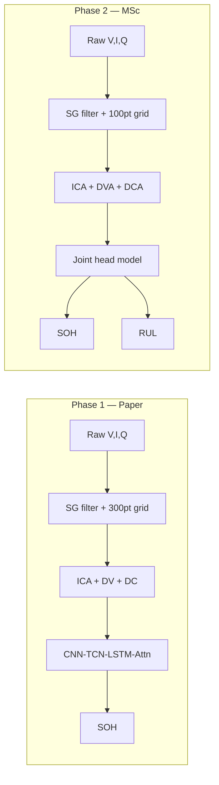

# Hybrid Deep Learning for Joint Battery SOH & RUL Prediction

**MSc Capstone — University of Roehampton (UK)**  
**Author:** [Vamshi Krishna Bandari](https://github.com/VamshiKrishnaBandari07)

[](https://doi.org/10.1038/s41598-026-39911-8)
[](https://pytorch.org)
[](https://www.python.org)
[](tests/)
[](https://github.com/VamshiKrishnaBandari07/MSc-CAPSTONE-PROJECT-SOH-RUL-PREDICTION/actions/workflows/ci.yml)

Reproducible research artefact: **paper-exact battery SOH prediction** (Experiment A) followed by an **MSc extension** for joint SOH+RUL with physics-informed learning (Experiments B & C). Evaluated on real **NASA**, **Oxford**, and **CALCE** datasets.

> **Programme:** MSc Artificial Intelligence, University of Roehampton (UK)  
> **Repository:** [MSc-CAPSTONE-PROJECT-SOH-RUL-PREDICTION](https://github.com/VamshiKrishnaBandari07/MSc-CAPSTONE-PROJECT-SOH-RUL-PREDICTION) — see [`docs/GITHUB.md`](docs/GITHUB.md) if migrating from the legacy URL.

```bash
git lfs install
git clone git@github.com:VamshiKrishnaBandari07/MSc-CAPSTONE-PROJECT-SOH-RUL-PREDICTION.git
cd MSc-CAPSTONE-PROJECT-SOH-RUL-PREDICTION
git lfs pull
```

---

## Executive summary

| | Detail |
|:---|:---|
| **Reference paper** | Rahman et al., *Sci. Rep.* 2026 — [DOI 10.1038/s41598-026-39911-8](https://doi.org/10.1038/s41598-026-39911-8) |
| **Phase 1** | Reproduce hybrid CNN–TCN–LSTM–Attention (ICA+DV+DC, 300-pt grid, MSE) |
| **Phase 2** | Joint SOH+RUL + monotonicity loss (original contribution) |
| **Best SOH RMSE (Exp A, Oxford, 5-fold CV)** | **0.0215 ± 0.0050** (paper target: 0.021) |
| **MSc model size** | **0.067 M params**, 2.8 ms inference — embedded-BMS feasible |
| **Reproducibility** | Fixed seed 42, JSON reports, unit tests, `verify_setup.py` |

Full results: [`docs/RESULTS.md`](docs/RESULTS.md) · Overview: [`docs/CAPSTONE_OVERVIEW.md`](docs/CAPSTONE_OVERVIEW.md)

---

## Capstone structure (run in this order)

```
Phase 1 ──► run_paper_experiment.py     Experiment A (paper SOH)
                │
                ▼
Phase 2 ──► run_experiments.py --msc-only   Experiment B (joint) + C (ablation)
```

| Phase | ID | Script | Output |
|:---:|:---|:---|:---|
| **1** | **A** | `python run_paper_experiment.py --require-real --cpu` | `results/paper_experiment_report.json` |
| **2** | **B** | `python run_experiments.py --msc-only --require-real --cpu` | `results/experiment_comparison_report.json` |
| **2** | **C** | (included in `--msc-only`) | Ablation metrics in same JSON |

> Run **Experiment A before B**. The MSc extension is built on validated paper methodology, not in parallel.

---

## Verified results (real data, committed)

### Experiment A — Paper reproduction (5-fold stratified CV)

| Dataset | SOH RMSE (mean ± std) | SOH R² | Paper target | Transformer |
|:---|:---:|:---:|:---:|:---:|
| NASA | **0.0385 ± 0.0048** | 0.915 | 0.021 | 0.038 |
| Oxford | **0.0215 ± 0.0050** | 0.951 | 0.021 | 0.038 |
| CALCE | **0.0673 ± 0.0101** | 0.950 | 0.021 | 0.038 |

### Experiment B — MSc extension (chronological 80/20)

| Dataset | SOH RMSE | RUL RMSE (cycles) |
|:---|:---:|:---:|
| NASA | 0.112 | 44.3 |
| Oxford | 0.041 | 14.2 |
| CALCE | 0.230 | 1.5 |

### Experiment C — Ablation (monotonicity loss)

| Dataset | SOH RMSE (no physics) | SOH RMSE (with physics) |
|:---|:---:|:---:|
| NASA | 0.078 | 0.112 |
| Oxford | **0.034** | 0.041 |
| CALCE | 0.355 | **0.230** |

Figures: [`results/figures/`](results/figures/) · Regenerate: `python generate_figures.py`

---

## Quick start

```powershell
pip install -r requirements.txt
git lfs pull
python scripts/verify_setup.py

# Phase 1 — Paper (5-fold CV, paper protocol)
python run_paper_experiment.py --require-real --cpu

# Phase 2 — MSc extension
python run_experiments.py --msc-only --require-real --cpu

python generate_figures.py
python scripts/sync_results_docs.py
python -m pytest tests/ -v
```

Or run the full pipeline:

```powershell
powershell -ExecutionPolicy Bypass -File scripts/run_full_pipeline.ps1
```

| Flag | Purpose |
|:---|:---|
| `--require-real` | Fail if datasets missing (no synthetic demo) |
| `--cpu` | Force CPU (auto-detected if no GPU) |
| `--dataset NASA` | Single dataset |
| `--chrono` | Fast 80/20 split (debug only, not paper protocol) |
| `--msc-only` | Skip Phase 1; run B+C only |
| `--paper-only` | Phase 1 only |

**CPU time:** Phase 1 with 5-fold CV ~2–8 h (all datasets); chronological debug ~30–90 min/dataset.

---

## Experiment A — Paper methodology

Aligned with Rahman et al. (2026) Section 3 and Table 2:

| Component | Specification |
|:---|:---|
| **Features** | ICA (`dQ/dV`), DV (`dV/dQ`), DC (`dI/dV`) |
| **Voltage grid** | 300 points, 2.5 V – 4.2 V |
| **Smoothing** | Savitzky–Golay, window=15, order=3 |
| **Architecture** | 1D-CNN (k=5) → BatchNorm → TCN → LSTM → Attention |
| **Loss** | MSE, SOH ∈ [0, 1] (sigmoid head) |
| **Training** | Adam 1e-3, up to 200 epochs, early stop 20, grad clip 5 |
| **Augmentation** | ±10 mV voltage jitter + feature noise (train only) |
| **Evaluation** | **Stratified 5-fold CV** (default) |
| **Parameters** | ~0.39 M (paper reports ~0.35 M) |

| Module | Role |
|:---|:---|
| [`run_paper_experiment.py`](run_paper_experiment.py) | Phase 1 entry |
| [`model_paper.py`](model_paper.py) | Paper architecture |
| [`preprocess_paper.py`](preprocess_paper.py) | Feature pipeline |
| [`experiments/paper_preprocessing.py`](experiments/paper_preprocessing.py) | ICA/DV/DC extraction |
| [`experiments/cv.py`](experiments/cv.py) | 5-fold CV splits |
| [`docs/PAPER_METHODOLOGY.md`](docs/PAPER_METHODOLOGY.md) | Paper-to-code map |

---

## Experiment B — MSc extension (original work)

| | Paper (A) | MSc (B) |
|:---|:---|:---|
| **Outputs** | SOH only | **Joint SOH + RUL** |
| **Loss** | MSE | MSE + RUL + **monotonicity penalty** |
| **Features** | 300-pt voltage grid | 100-pt grid (ICA, DVA, DCA) |
| **Model** | `model_paper.py` | [`model.py`](model.py) |
| **Params** | 0.39 M | **0.067 M** |

Physics-informed loss (Experiment B):

$$\mathcal{L} = \mathcal{L}_{SOH} + \alpha \mathcal{L}_{RUL} + \gamma \mathcal{L}_{mono}$$

---

## Architecture



---

## Repository layout

```text
run_paper_experiment.py      # Phase 1 — START HERE
run_experiments.py           # Phase 2 or full suite
model_paper.py / model.py    # Experiment A / B architectures
preprocess_paper.py          # Paper features (ICA,DV,DC)
preprocess.py                # MSc features + RUL labels
download_data.py             # NASA, Oxford, CALCE fetch
generate_figures.py          # Thesis figures (7 plots)
experiments/                 # Config, trainer, CV, loaders, metrics
results/                     # JSON reports + figures (in git)
docs/                        # Methodology, results, capstone overview
tests/                       # Unit tests (metrics, preprocessing, loaders)
scripts/verify_setup.py      # Environment + data verification
scripts/run_full_pipeline.ps1 # One-command Phase 1 → 2 → figures
scripts/sync_results_docs.py  # Refresh docs/RESULTS.md from JSON
```

---

## Data policy

| In git | Not in git |
|:---|:---|
| Code, docs, tests, results JSON & figures | MSc report `.docx` (local only) |
| **Raw datasets (~437 MB) via Git LFS** | `checkpoints/` (retrain locally) |

```powershell
git lfs install
git clone git@github.com:VamshiKrishnaBandari07/MSc-CAPSTONE-PROJECT-SOH-RUL-PREDICTION.git
cd MSc-CAPSTONE-PROJECT-SOH-RUL-PREDICTION
git lfs pull
```

Fallback if LFS unavailable: `python download_data.py --all`

Details: [`docs/DATA_AND_GIT.md`](docs/DATA_AND_GIT.md)

---

## Documentation index

| Document | Description |
|:---|:---|
| [`docs/CAPSTONE_OVERVIEW.md`](docs/CAPSTONE_OVERVIEW.md) | Examiner summary — problem, phases, reproducibility |
| [`docs/RESULTS.md`](docs/RESULTS.md) | Full results tables + interpretation |
| [`docs/PAPER_METHODOLOGY.md`](docs/PAPER_METHODOLOGY.md) | Paper alignment + CLI reference |
| [`docs/PAPER_EXPERIMENT_METRIC_COMPARISON.md`](docs/PAPER_EXPERIMENT_METRIC_COMPARISON.md) | Metric history + protocol notes |
| [`docs/THESIS_RESULTS.md`](docs/THESIS_RESULTS.md) | Thesis-ready tables (copy to Word locally) |
| [`docs/GITHUB.md`](docs/GITHUB.md) | Repository naming, clone URLs, CI |
| [`docs/DATA_AND_GIT.md`](docs/DATA_AND_GIT.md) | Git vs local data policy |

---

## Reproducibility & limitations

| Topic | Detail |
|:---|:---|
| **Seed** | 42 (`experiments/config.py`) |
| **Exp A eval** | Stratified **5-fold CV** (paper protocol); `--chrono` for 80/20 debug only |
| **Exp B/C eval** | Chronological 80/20 split (MSc default) |
| **Committed JSON** | `paper_experiment_report.json` (CV) + `experiment_comparison_report.json` (A merged + B/C) |
| **Training stability** | Best checkpoint saved per fold if validation diverges |
| **Ethics** | Public datasets only; no human subjects |
| **Honest reporting** | Oxford matches paper 0.021 on CV; CALCE remains harder (heterogeneous cells) |

---

## Testing

```powershell
python -m pytest tests/ -v
```

| Test file | Coverage |
|:---|:---|
| `test_paper_preprocessing.py` | ICA/DV/DC shapes, NaN sanitization |
| `test_metrics.py` | RMSE, R², monotonicity, splits |
| `test_loaders.py` | NASA/Oxford/CALCE real-data loaders |

---

## References

1. Rahman, T. et al. Deep learning-based battery health prediction for enhancing electric vehicle performance. *Sci. Rep.* **16**, 9871 (2026). [https://doi.org/10.1038/s41598-026-39911-8](https://doi.org/10.1038/s41598-026-39911-8)
2. NASA PCoE Battery Aging Datasets. [https://data.nasa.gov/dataset/li-ion-battery-aging-datasets](https://data.nasa.gov/dataset/li-ion-battery-aging-datasets)
3. Oxford Battery Degradation Dataset 1. [https://ora.ox.ac.uk/objects/uuid:03ba4b01-cfed-46d3-9b1a-7d4a7bdf6fac](https://ora.ox.ac.uk/objects/uuid:03ba4b01-cfed-46d3-9b1a-7d4a7bdf6fac)
4. CALCE Battery Research Group. [https://calce.umd.edu/battery-data](https://calce.umd.edu/battery-data)

---

## License & contact

MIT License — see [`LICENSE`](LICENSE). Academic capstone work, University of Roehampton.  
**Author:** [Vamshi Krishna Bandari](https://github.com/VamshiKrishnaBandari07)

For reproduction issues: open a GitHub issue or run `python scripts/verify_setup.py` first.
