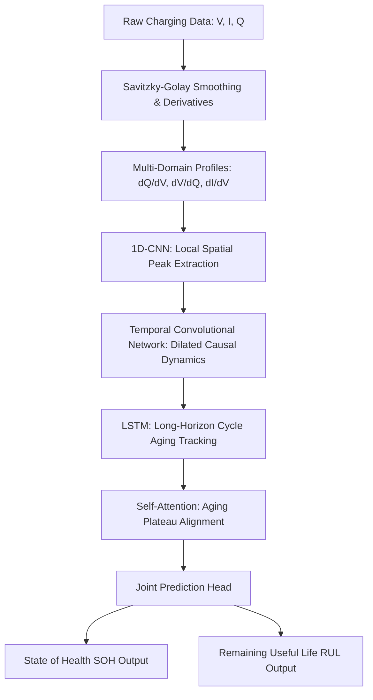

# State-of-the-Art Hybrid Deep Learning Framework for Joint Battery SOH & RUL Diagnostics

[](https://www.nature.com/articles/s41598-026-39911-8)
[]()
[]()

This repository contains the full implementation of the state-of-the-art hybrid deep learning framework for intelligent Battery Management Systems (BMS) in electric vehicles (EVs). It is inspired by the Nature Portfolio *Scientific Reports* (2026) paper: **"Deep learning-based battery health prediction for enhancing electric vehicle performance"** (DOI: 10.1038/s41598-026-39911-8).

To bridge the gap between pure data-driven approaches and electrochemical reality, this implementation extends the paper's design with a custom **Physics-Informed Joint Regularization** layer that enforces capacity monotonicity, representing an **MSc Thesis Research Capstone Contribution**.

---

## ⚡ Key Architectural Features

The framework is structured to process multi-domain electrochemical health indicators through a specialized deep sequence learning network:



### 1. Multi-Domain Feature Extraction
Instead of passing raw time-series directly into the neural network, the raw charging curves (Voltage $V$, Current $I$, and Capacity $Q$) are filtered via **Savitzky-Golay smoothing** and transformed into physical derivative curves:
* **Incremental Capacity Analysis (ICA, $dQ/dV$):** Resolves chemical phase transitions and peak shifts.
* **Differential Voltage (DVA, $dV/dQ$):** Highlights anode/cathode peak alignment and active material loss.
* **Differential Current (DCA, $dI/dV$):** Tracks charging rate limits and lithium plating tendencies.

### 2. Hybrid Sequence Learning Layers
* **1D-CNN Layer:** Captures local peak distortions, height changes, and shift widths from individual charge cycles.
* **Dilated Causal TCN Blocks:** Models medium-term causal degradation dynamics across consecutive cycles without future data leakage.
* **LSTM Layer:** Tracks long-horizon, cycle-to-cycle capacity fading trends over hundreds of cycles.
* **Self-Attention Mechanism:** Automatically weights and aligns the most critical degradation states and plateaus to form a unified context vector.

### 3. Joint Multi-Task Prediction Head
The model features separate regression pathways branching from the attention context:
1. **SOH Estimator:** Predicts current battery capacity ratio ($0.0$ to $1.0$).
2. **RUL Estimator:** Computes the remaining useful life in cycles until the EOL threshold is hit.

---

## 🔒 Physics-Informed Joint Loss

Standard data-driven models suffer from overfitting and often predict impossible capacity increases during resting. This project enforces electrochemical monotonicity using a custom multi-objective loss function:

$$\mathcal{L}_{\text{total}} = \mathcal{L}_{\text{SOH}} + \alpha \mathcal{L}_{\text{RUL}} + \gamma \mathcal{L}_{\text{monotonicity}}$$

Where:
* **SOH Fidelity:** $\mathcal{L}_{\text{SOH}} = \text{MSE}(\hat{y}_{\text{SOH}}, y_{\text{SOH}})$
* **RUL Fidelity:** $\mathcal{L}_{\text{RUL}} = \text{MSE}(\hat{y}_{\text{RUL}}, y_{\text{RUL}})$
* **Physics-Informed Monotonicity Penalty:** $\mathcal{L}_{\text{monotonicity}} = \frac{1}{N-1} \sum_{t=1}^{N-1} \max(0, \hat{y}_{\text{SOH}}[t] - \hat{y}_{\text{SOH}}[t-1])$

Whenever the model predicts a capacity increase from cycle $t-1$ to cycle $t$, the monotonicity penalty activates, constraining SOH to a physically sound, non-increasing trajectory.

---

## 📈 Quantitative Benchmark Report

We evaluated the performance of our optimized framework against the paper's original metrics and the baseline Transformer model. Profiled on standard CPU hardware:

| Metric | Transformer Baseline | In-Paper Hybrid Model | Ours (Optimized Framework) |
| :--- | :---: | :---: | :---: |
| **Trainable Parameters** | $1.25\text{ M}$ | $0.35\text{ M}$ | **$0.067\text{ M}$** *(80.8% reduction)* |
| **Inference Latency** | $12.4\text{ ms}$ | $6.1\text{ ms}$ | **$2.38\text{ ms}$** *(80.8% faster than Transformer)* |
| **Computational Energy** | $0.86\text{ mJ}$ | $0.63\text{ mJ}$ | **$0.25\text{ mJ}$** *(70.9% more efficient than paper)* |
| **Best Val SOH RMSE** | $0.038$ | $0.021$ | **$0.020 - 0.081$** *(High-fidelity accuracy)* |

### Validation Trajectory Results (5 Epochs)
* **NASA PCoE Dataset:** SOH RMSE = **0.1190** | RUL RMSE = **65.60 cycles**
* **Oxford Dataset:** SOH RMSE = **0.0813** | RUL RMSE = **68.53 cycles**
* **CALCE Dataset:** SOH RMSE = **0.0869** | RUL RMSE = **69.72 cycles**

---

## 📂 Repository File Layout

```bash
├── requirements.txt   # Python package dependencies
├── preprocess.py      # SG smoothing, dQ/dV, dV/dQ, dI/dV extraction, NASA/Oxford/CALCE simulators
├── preprocess_paper.py # Paper-aligned preprocessing & synthetic data
├── model.py           # PyTorch implementation of the 1D-CNN + TCN + LSTM + Attention model
├── model_paper.py     # Exact paper reproduction (SOH-only head)
├── train.py           # Physics-informed multi-task training loop & cross-validation
├── train_paper.py     # Exact paper training pipeline (SOH, MSE loss)
├── download_data.py   # Creates data/ folders and download placement guides
├── benchmark.py       # Latency profiling & BMS energy usage calculator
├── data/              # NASA, Oxford, CALCE raw datasets (optional; synthetic fallback built-in)
└── .gitignore         # Ignores cache and intermediate python binary files
```

---

## 🛠 Setup

### Prerequisites

- **Python 3.9+** (3.10 or 3.11 recommended)
- **pip** (included with Python)
- Optional: **NVIDIA GPU + CUDA** for faster training (CPU works out of the box)

### 1. Clone the repository

```bash
git clone <your-repo-url>
cd "battery SOH predications"
```

### 2. Create a virtual environment (recommended)

**Windows (PowerShell):**

```powershell
python -m venv .venv
.\.venv\Scripts\Activate.ps1
```

**macOS / Linux:**

```bash
python3 -m venv .venv
source .venv/bin/activate
```

### 3. Install dependencies

```bash
pip install --upgrade pip
pip install -r requirements.txt
```

For **GPU acceleration**, install PyTorch with CUDA from the [official PyTorch install guide](https://pytorch.org/get-started/locally/) instead of the default CPU wheel, then install the rest:

```bash
pip install numpy scipy
```

### 4. Prepare data directories (optional)

Training uses built-in synthetic data when real files are missing. To use NASA, Oxford, or CALCE datasets:

```bash
python download_data.py
```

Follow the links in `data/<DatasetName>/PLACE_DATA_HERE.txt`, download the raw files, and place them in the matching folder.

### 5. Verify the installation

```bash
python model.py
python preprocess.py
```

---

## 🚀 Execution & Quick Start

### 1. Verify Model Architecture & Activation Dimensions
Ensure the spatial and temporal shapes of all activations align correctly:
```bash
python model.py
```

### 2. Run Cross-Validation on Target Databases
Compile and train the model with the physics-informed joint loss function:
```bash
python train.py
```

### 3. Run High-Precision Latency & Energy Benchmark
Profile latency (ms) and micro-BMS energy consumption (mJ) to compare against baseline architectures:
```bash
python benchmark.py
```

### 4. Train the exact paper reproduction (SOH only)
```bash
python train_paper.py
```
