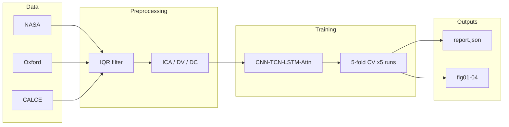

# Deep Learning-Based Battery Health Prediction — Paper Reproduction

[](https://www.nature.com/articles/s41598-026-39911-8)
[](https://doi.org/10.1038/s41598-026-39911-8)
[](https://github.com/VamshiKrishnaBandari07/MSc-CAPSTONE-PROJECT-SOH-RUL-PREDICTION--/actions/workflows/ci.yml)

Independent reproduction of Rahman *et al.* (*Scientific Reports* **16**, 9871, 2026): a hybrid **CNN–TCN–LSTM–attention** model for lithium-ion **State-of-Health (SOH)** estimation on **NASA PCoE**, **Oxford**, and **CALCE** data.

**Author:** [Vamshi Krishna Bandari](https://github.com/VamshiKrishnaBandari07) · University of Roehampton · MSc Artificial Intelligence  
**Reference:** [Article](https://www.nature.com/articles/s41598-026-39911-8) · [DOI 10.1038/s41598-026-39911-8](https://doi.org/10.1038/s41598-026-39911-8)

This repository is **paper-only** (SOH). MSc capstone RUL/joint work remains in local `local_archive/` (not published here).

---

## Executive summary

| Outcome | Detail |
|:---|:---|
| **Training** | Completed on real data: **3 datasets × 5 independent runs × stratified 5-fold CV** (CPU, ~7 h) |
| **Oxford** | Mean pooled OOF RMSE **0.0215 ± 0.0045** — aligns with the paper hybrid target (**0.021**) |
| **NASA (Table 4)** | Mean RMSE **0.0417 ± 0.0023** — methodology reproduced; **does not match** published **0.021** (near Transformer baseline **0.038**) |
| **CALCE** | Mean RMSE **0.0544 ± 0.0147** — cross-chemistry benchmark (no Table 4 target) |
| **Artifacts** | `results/paper_experiment_report.json`, `results/summary.json`, figures **fig01–fig04**, passing `verify_repo` + pytest |

Results are **reported honestly** from completed training; metrics are not adjusted to match the article.

---

## Reproduced results (Table 4 protocol)

**Protocol:** Stratified **5-fold CV**, **five independent runs** (seeds 42–46), mean **pooled out-of-fold SOH RMSE** per run, then averaged across runs (as in the paper Methods).

| Dataset | Mean SOH RMSE (± std across 5 runs) | Per-run RMSE | Paper reference |
|:---|:---:|:---|:---|
| **NASA PCoE** | **0.0417 ± 0.0023** | 0.0404, 0.0392, 0.0428, 0.0407, 0.0456 | Table 4 hybrid **0.021** |
| **Oxford** | **0.0215 ± 0.0045** | 0.0268, **0.0154**, 0.0183, 0.0266, 0.0205 | Same order as **0.021** |
| **CALCE** | **0.0544 ± 0.0147** | 0.0502, 0.0454, 0.0463, 0.0835, 0.0464 | Cross-dataset benchmark |

**Figures:** `results/figures/fig01_soh_trajectories` · `fig02_soh_scatter` · `fig03_soh_rmse_comparison` · `fig04_training_convergence`

**Interpretation:** The pipeline and architecture reproduce the paper’s **Oxford** accuracy. The **NASA** gap is discussed in [docs/RESULTS.md](docs/RESULTS.md) and [docs/PAPER_METHODOLOGY.md](docs/PAPER_METHODOLOGY.md) (CV pooling across cells, feature construction, training stability). See [docs/SUPERVISOR_GUIDE.md](docs/SUPERVISOR_GUIDE.md) for examiner-facing notes.

---

## Methodology alignment (Section 3)

| # | Paper requirement | Implementation |
|:---:|:---|:---|
| 1 | SOH only (Eq. 1: Q_k / Q_BoL) | `run_paper_experiment.py`, per-cell BoL in loaders |
| 2 | NASA PCoE, Oxford, CALCE | `experiments/nasa_loader.py`, `oxford_loader.py`, `calce_loader.py` |
| 3 | ICA, DV, DC on 300-pt grid, 2.5–4.2 V | `experiments/paper_preprocessing.py` |
| 4 | Savitzky–Golay (15, 3) | `paper_config.py` |
| 5 | ±10 mV voltage jitter (train) | Preprocessing + `trainer.py` augmentation |
| 6 | CNN → TCN → LSTM → attention | `model_paper.py` (~0.39M params) |
| 7 | MSE, Adam 1e-3, grad clip 5, early stopping | `experiments/trainer.py` |
| 8 | Stratified 5-fold CV (optional cell-grouped) | `experiments/cv.py` |
| 8b | Global per-channel scale + IQR filter | `experiments/paper_data.py` |
| 9 | Five independent runs (Table 4) | `PAPER_RUN_SEEDS` in `run_paper_experiment.py` |

---

## Pipeline



---

## Quick start

```powershell
git lfs install
git clone https://github.com/VamshiKrishnaBandari07/MSc-CAPSTONE-PROJECT-SOH-RUL-PREDICTION--.git
cd MSc-CAPSTONE-PROJECT-SOH-RUL-PREDICTION--
git lfs pull
pip install -r requirements.txt
python download_data.py --all
python scripts/verify_repo.py
```

**Reproduce training** (long on CPU; GPU recommended):

```powershell
python scripts/run_train_and_eval.py
```

Or step by step:

```powershell
python run_paper_experiment.py --require-real --cpu --cv
python generate_figures.py
python scripts/export_summary.py
python scripts/sync_results_docs.py
```

**Monitor progress:**

```powershell
python scripts/show_progress.py
```

**If training finished but report save failed:**

```powershell
python scripts/finish_pipeline.py
```

---

## Repository contents

| Included on GitHub | Excluded (gitignored / local) |
|:---|:---|
| Paper experiment code and tests | `local_archive/` (MSc SOH+RUL) |
| `data/` via Git LFS | `checkpoints/` |
| Committed metrics and fig01–04 | `validation_predictions.json`, logs |
| `docs/` methodology and results | Legacy RUL scripts and figures |

```
run_paper_experiment.py     # 3 datasets, 5-fold CV, 5 runs
model_paper.py              # Hybrid SOH network
preprocess_paper.py         # Feature pipeline
experiments/                # Loaders, CV, trainer, stability helpers
scripts/                    # verify_repo, finish_pipeline, show_progress
results/                    # paper_experiment_report.json, figures
tests/
docs/
```

---

## Verification

```powershell
python scripts/verify_repo.py
python -m pytest tests/ -v
```

---

## Citation

**Paper under reproduction:**

```bibtex
@article{Rahman2026,
  author  = {Rahman, Tawfikur and Deb, Nibedita and Moniruzzaman, Md. and others},
  title   = {Deep learning-based battery health prediction for enhancing electric vehicle performance},
  journal = {Scientific Reports},
  volume  = {16},
  pages   = {9871},
  year    = {2026},
  doi     = {10.1038/s41598-026-39911-8}
}
```

MIT License — see [LICENSE](LICENSE).
