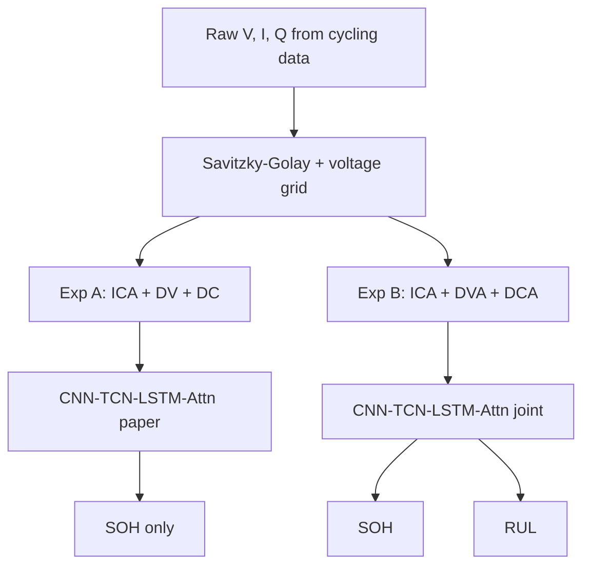

# MSc Capstone: Hybrid Deep Learning for Joint Battery SOH & RUL Prediction

[](https://www.nature.com/articles/s41598-026-39911-8)
[]()
[]()

**Author:** [Vamshi Krishna Bandari](https://github.com/VamshiKrishnaBandari07)  
**GitHub:** [MSc-CAPSTONE-PROJECT-SOH-RUL-PREDICATION-](https://github.com/VamshiKrishnaBandari07/MSc-CAPSTONE-PROJECT-SOH-RUL-PREDICATION-)

```bash
git clone git@github.com:VamshiKrishnaBandari07/MSc-CAPSTONE-PROJECT-SOH-RUL-PREDICATION-.git
```

> **Data policy:** Raw datasets (~500 MB) are **not in git** — download with [`download_data.py`](download_data.py).  
> See [`docs/DATA_AND_GIT.md`](docs/DATA_AND_GIT.md). Verified metrics and figures live in [`results/`](results/).

---

## Capstone structure (professor requirement)

This project follows a **two-phase** design:

| Phase | Experiment | Goal |
|:---:|:---|:---|
| **1** | **Experiment A** | Implement and validate the [Scientific Reports (2026)](https://doi.org/10.1038/s41598-026-39911-8) paper methodology on **real NASA, Oxford, and CALCE** data |
| **2** | **Experiment B** | **MSc extension** — joint SOH + RUL prediction with physics-informed monotonicity loss (built **after** paper reproduction) |
| — | **Experiment C** | Ablation — Experiment B without physics penalty |

**Paper reference:** Rahman et al., *Deep learning-based battery health prediction for enhancing electric vehicle performance*, [DOI 10.1038/s41598-026-39911-8](https://doi.org/10.1038/s41598-026-39911-8)

---

## Experiment A — Paper reproduction (implement first)

Replicates the published hybrid **CNN–TCN–LSTM–Attention** model for **SOH-only** prediction.

| Item | Paper / this repo |
|:---|:---|
| **Features** | ICA (`dQ/dV`), DV (`dV/dQ`), DC (`dI/dV`) |
| **Voltage grid** | 300 points, 2.5 V – 4.2 V |
| **Denoising** | Savitzky–Golay (window = 15, order = 3) |
| **Model** | 1D-CNN (k=5) + BatchNorm + TCN + LSTM + Attention |
| **Loss** | MSE, SOH output ∈ [0, 1] |
| **Training** | Up to 200 epochs, early stopping, grad clip 5, LR schedule, ±10 mV augmentation |
| **Parameters** | ~0.39 M (paper reports ~0.35 M) |
| **Target metrics** | SOH RMSE ≈ **0.021**, R² ≈ **0.983** |
| **Datasets** | NASA PCoE, Oxford, CALCE (real data via download) |

| File | Role |
|:---|:---|
| [`run_paper_experiment.py`](run_paper_experiment.py) | **Main entry** — Experiment A on all datasets |
| [`model_paper.py`](model_paper.py) | Paper architecture |
| [`preprocess_paper.py`](preprocess_paper.py) | ICA + DV + DC feature pipeline |
| [`experiments/paper_config.py`](experiments/paper_config.py) | Paper hyperparameters |
| [`docs/PAPER_METHODOLOGY.md`](docs/PAPER_METHODOLOGY.md) | Paper-to-code mapping |

```powershell
python download_data.py --all
python run_paper_experiment.py
```

Output: [`results/paper_experiment_report.json`](results/paper_experiment_report.json)

---

## Experiment B — MSc extension (after paper implementation)

Extends Experiment A with a **joint prediction head** and **physics-informed regularisation**. This is the **original MSc contribution**, not part of the published paper.

| Item | Experiment A (paper) | Experiment B (MSc) |
|:---|:---|:---|
| **Prediction** | SOH only | **Joint SOH + RUL** |
| **Loss** | MSE | MSE + RUL + **monotonicity penalty** |
| **Features** | ICA, DV, DC (300-pt grid) | ICA, DVA, DCA (100-pt grid) |
| **Model** | `model_paper.py` | [`model.py`](model.py) |
| **Preprocessing** | `preprocess_paper.py` | [`preprocess.py`](preprocess.py) |

| File | Role |
|:---|:---|
| [`train.py`](train.py) | Experiment B only |
| [`run_experiments.py`](run_experiments.py) | Full suite: A + B + C + benchmark |

```powershell
python run_experiments.py
```

Output: [`results/experiment_comparison_report.json`](results/experiment_comparison_report.json)

---

## Quick start (recommended order)

| Step | Command | Purpose |
|:---:|:---|:---|
| 1 | `pip install -r requirements.txt` | Install dependencies |
| 2 | `python scripts/verify_setup.py` | Check Python, packages, data |
| 3 | `python download_data.py --all` | Download real NASA, Oxford, CALCE |
| 4 | **`python run_paper_experiment.py`** | **Experiment A** (paper methodology) |
| 5 | `python run_experiments.py` | **Experiments A + B + C** (full capstone) |
| 6 | `python generate_figures.py` | Thesis figures (PNG + PDF) |
| 7 | `pytest tests/ -v` | Run unit tests |

NASA-only paper run: `python run_nasa_real.py`

---

## Published vs local results

| | Paper (Table 4) | Experiment A (re-run after clone) |
|:---|:---:|:---:|
| SOH RMSE | **0.021** | Run `run_paper_experiment.py` |
| SOH R² | **0.983** | Reported in JSON output |
| Parameters | 0.35 M | ~0.39 M |

> Previous results in `results/` may pre-date the paper-aligned ICA+DV+DC pipeline. **Re-run Experiment A** after clone for thesis tables.

---

## Architecture overview



### Physics-informed loss (Experiment B only)

$$\mathcal{L}_{\text{total}} = \mathcal{L}_{\text{SOH}} + \alpha \mathcal{L}_{\text{RUL}} + \gamma \mathcal{L}_{\text{monotonicity}}$$

---

## Repository layout

```text
run_paper_experiment.py   # Experiment A — paper reproduction (START HERE)
run_experiments.py        # Experiments A + B + C + comparison report
run_nasa_real.py          # Experiment A on NASA real data only
train_paper.py            # Alias → run_paper_experiment.py
train.py                  # Experiment B — MSc extension only
model_paper.py            # Paper model (SOH head)
model.py                  # MSc model (joint SOH + RUL head)
preprocess_paper.py       # Paper features: ICA, DV, DC
preprocess.py             # MSc features: ICA, DVA, DCA + RUL labels
download_data.py          # Download NASA, Oxford, CALCE
experiments/              # Config, trainer, metrics, loaders
docs/                     # Methodology, thesis results, data policy
results/                  # JSON reports + thesis figures (committed)
tests/                    # Unit tests
scripts/verify_setup.py   # Environment check
```

---

## Setup

**Requirements:** Python 3.9+, PyTorch 2.0+, see [`requirements.txt`](requirements.txt)

<details>
<summary>Detailed setup (venv, clone, GPU)</summary>

```powershell
git clone git@github.com:VamshiKrishnaBandari07/MSc-CAPSTONE-PROJECT-SOH-RUL-PREDICATION-.git
cd MSc-CAPSTONE-PROJECT-SOH-RUL-PREDICATION-
python -m venv .venv
.\.venv\Scripts\Activate.ps1
pip install -r requirements.txt
python download_data.py --all
```

GPU: install CUDA PyTorch from [pytorch.org](https://pytorch.org/get-started/locally/) first.

</details>

---

## Documentation

| Document | Description |
|:---|:---|
| [`docs/PAPER_METHODOLOGY.md`](docs/PAPER_METHODOLOGY.md) | Experiment A — paper alignment |
| [`docs/PAPER_EXPERIMENT_METRIC_COMPARISON.md`](docs/PAPER_EXPERIMENT_METRIC_COMPARISON.md) | Metric history and reproducibility |
| [`docs/THESIS_RESULTS.md`](docs/THESIS_RESULTS.md) | Results chapter draft |
| [`docs/DATA_AND_GIT.md`](docs/DATA_AND_GIT.md) | What is / is not in GitHub |

---

## Reproducibility and limitations

| Topic | Detail |
|:---|:---|
| **Random seed** | 42 (`experiments/config.py`) |
| **Real data** | NASA `.mat`, Oxford `.mat`, CALCE `.xlsx` — download required |
| **Experiment A split** | 80/20 chronological (paper uses 5-fold CV) |
| **Experiment B epochs** | 25 + early stopping (MSc demo budget) |
| **Experiment A epochs** | Up to 200 + early stopping (paper protocol) |
| **Energy / latency** | Estimated on local hardware — comparative only |

---

## References

1. Rahman, T. et al. Deep learning-based battery health prediction for enhancing electric vehicle performance. *Sci. Rep.* **16**, 9871 (2026). [https://doi.org/10.1038/s41598-026-39911-8](https://doi.org/10.1038/s41598-026-39911-8)
2. [NASA PCoE Battery Dataset](https://data.nasa.gov/dataset/li-ion-battery-aging-datasets)
3. [Oxford Battery Degradation Dataset](https://ora.ox.ac.uk/objects/uuid:03ba4b01-cfed-46d3-9b1a-7d4a7bdf6fac)
4. [CALCE Battery Data](https://calce.umd.edu/battery-data)

---

## License

Academic work — MSc Capstone. Contact [Vamshi Krishna Bandari](https://github.com/VamshiKrishnaBandari07) for reuse.
