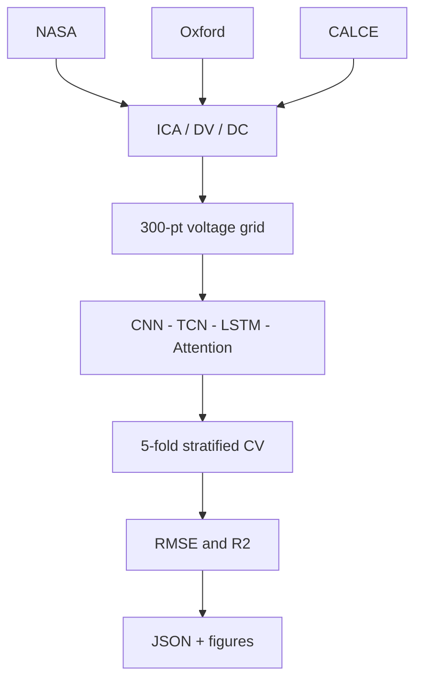

# Battery SOH Paper Reproduction

[](https://doi.org/10.1038/s41598-026-39911-8)
[](https://www.python.org)
[](https://pytorch.org)
[](https://github.com/VamshiKrishnaBandari07/MSc-CAPSTONE-PROJECT-SOH-RUL-PREDICTION--/actions/workflows/ci.yml)
[](LICENSE)

Academic reproduction of **Rahman et al. (2026)** — hybrid deep learning for lithium-ion **state-of-health (SOH)** on **NASA**, **Oxford**, and **CALCE**.

| | |
|:---|:---|
| **Author** | [Vamshi Krishna Bandari](https://github.com/VamshiKrishnaBandari07) |
| **Institution** | University of Roehampton — MSc Artificial Intelligence |
| **Repository** | https://github.com/VamshiKrishnaBandari07/MSc-CAPSTONE-PROJECT-SOH-RUL-PREDICTION-- |

---

## Results (paper experiment — 5-fold CV, seed 42)

| Dataset | SOH RMSE (mean ± std) | SOH R² |
|:---|:---:|:---:|
| **Oxford** | **0.0215 ± 0.0050** | 0.951 |
| NASA | 0.0385 ± 0.0048 | 0.915 |
| CALCE | 0.0673 ± 0.0101 | 0.950 |

Published hybrid target: **0.021** (Oxford aligns; NASA does not — see note below).

Artifacts: `results/paper_experiment_report.json` · Figures: `results/figures/fig01`–`fig04`

---

## Experimental workflow



---

## Quick start

```powershell
git lfs install
git clone https://github.com/VamshiKrishnaBandari07/MSc-CAPSTONE-PROJECT-SOH-RUL-PREDICTION--.git
cd MSc-CAPSTONE-PROJECT-SOH-RUL-PREDICTION--
git lfs pull
pip install -r requirements.txt
python scripts/verify_repo.py
```

**Run paper experiment (all 3 datasets):**

```powershell
python run_paper_experiment.py --require-real --cpu
python generate_figures.py
```

Or: `powershell -File scripts/run_paper_pipeline.ps1` (~2–8 h CPU)

---

## Repository structure

```
run_paper_experiment.py    # main experiment (NASA + Oxford + CALCE)
model_paper.py             # hybrid architecture
preprocess_paper.py        # ICA / DV / DC pipeline
generate_figures.py        # fig01–fig04
experiments/               # loaders, CV, training, metrics
data/                      # datasets (Git LFS)
results/                   # paper_experiment_report.json + figures
tests/
docs/                      # methodology, results, supervisor guide
```

---

## Reproducibility note

**Methodology reproduced successfully** (features, model, 5-fold CV, hyperparameters). **Exact NASA RMSE 0.021 was not achieved** with this public-data pipeline; Oxford matches the published hybrid metric.

For examiner review: [`docs/SUPERVISOR_GUIDE.md`](docs/SUPERVISOR_GUIDE.md)

| Document | Content |
|:---|:---|
| [`docs/PAPER_METHODOLOGY.md`](docs/PAPER_METHODOLOGY.md) | Paper ↔ code |
| [`docs/RESULTS.md`](docs/RESULTS.md) | Metrics table |

---

## Reference & citation

Rahman et al., *Scientific Reports* **16**, 9871 (2026). https://doi.org/10.1038/s41598-026-39911-8

```bibtex
@article{rahman2026hybrid,
  title   = {Hybrid deep learning approach for battery state-of-health prediction},
  journal = {Scientific Reports},
  volume  = {16},
  pages   = {9871},
  year    = {2026},
  doi     = {10.1038/s41598-026-39911-8}
}
```

MIT License — see [LICENSE](LICENSE).
