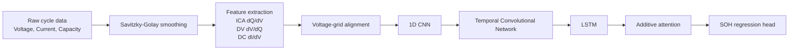
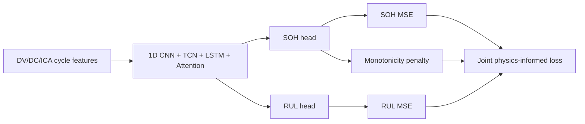

# Battery SOH and RUL Diagnostics with Paper-First Reproduction Workflow

[]()
[]()
[](https://www.nature.com/articles/s41598-026-39911-8)

This repository is an MSc Artificial Intelligence capstone project for electric-vehicle battery diagnostics. It contains:

1. a **paper-aligned SOH reproduction workflow** in `paper_exp/`;
2. the repository's **modified MSc contribution**: joint State-of-Health (SOH) and Remaining Useful Life (RUL) prediction with a physics-informed monotonicity term; and
3. a **comparison workflow** that runs the paper experiment first, then the modified experiment, then writes JSON and Markdown reports.

The repository should be read as an **engineering reproduction and extension** of the referenced Scientific Reports article, not as a guaranteed replication of the paper's published metrics from a fresh clone. The paper-level result claims require the real datasets, the full training schedule, hardware details, and generated artefacts.

---

## Referenced paper

> Deep learning-based battery health prediction for enhancing electric vehicle performance.  
> Scientific Reports. DOI: `10.1038/s41598-026-39911-8`

Reported paper targets used for comparison:

| Metric | Paper reported value |
| --- | ---: |
| SOH RMSE | `0.021` |
| SOH R2 | `0.983` |
| Parameters | `~0.35M` |
| Latency | `6.1 ms/sample` |
| Energy | `0.63 mJ/sample` |

---

## Repository structure

```text
.
├── README.md
├── requirements.txt
├── docs/
│   └── PAPER_EXPERIMENT_METRIC_COMPARISON.md
├── data/
│   ├── NASA/PLACE_DATA_HERE.txt
│   ├── Oxford/PLACE_DATA_HERE.txt
│   ├── CALCE/PLACE_DATA_HERE.txt
│   └── KaggleSDG7/PLACE_DATA_HERE.txt
├── paper_exp/
│   ├── config.py
│   ├── model.py
│   ├── preprocess.py
│   ├── prepare_data.py
│   ├── train.py
│   ├── modified_experiment.py
│   ├── compare_results.py
│   ├── run_comparison.py
│   └── README.md
├── model.py                  # modified MSc joint SOH/RUL model
├── train.py                  # modified MSc training loop
├── preprocess.py             # synthetic fallback preprocessing for legacy scripts
├── benchmark.py
├── model_paper.py            # legacy paper-style demo
├── preprocess_paper.py       # legacy paper-style demo
└── train_paper.py            # legacy paper-style demo
```

`paper_exp/` is the canonical paper-first workflow. The root `*_paper.py` files are retained as lightweight legacy demonstrations and should not be treated as the primary paper reproduction.

Generated outputs are ignored by git:

```text
paper_exp/outputs/
data/processed/*.npz
data/KaggleSDG7/*
```

---

## Architecture

### Paper-aligned SOH pipeline



### Modified MSc contribution



The modified objective is:

```math
\mathcal{L}_{total}
= \mathcal{L}_{SOH}
+ \alpha \mathcal{L}_{RUL}
+ \gamma \mathcal{L}_{mono}
```

where the monotonicity term penalises predicted SOH increases across adjacent cycle predictions.

---

## Installation

### 1. Clone and create an environment

```bash
git clone <repository-url>
cd <repository-folder>

python3 -m venv .venv
source .venv/bin/activate
```

On Windows PowerShell:

```powershell
python -m venv .venv
.\.venv\Scripts\Activate.ps1
```

### 2. Install dependencies

```bash
pip install --upgrade pip
pip install -r requirements.txt
```

For CUDA acceleration, install a CUDA-compatible PyTorch wheel from the official PyTorch instructions before running the experiments.

### 3. Verify the installation

```bash
python3 -m paper_exp.model
python3 -m paper_exp.preprocess
python3 -m paper_exp.train --smoke
```

---

## Data preparation

### Supported sources

| Source | Folder | Notes |
| --- | --- | --- |
| NASA PCoE battery data | `data/NASA/` | Raw `.mat` files such as `B0005.mat` |
| Oxford Battery Degradation dataset | `data/Oxford/` | Raw `.mat` files |
| CALCE battery data | `data/CALCE/` | CSV/XLS/XLSX files |
| Kaggle SDG 7 dataset | `data/KaggleSDG7/` | User-provided Kaggle source |

Create placement guides:

```bash
python3 download_data.py
```

### Kaggle SDG 7 dataset

Dataset URL:

```text
https://www.kaggle.com/datasets/drtawfikrrahman/deep-learning-ev-battery-pack-diagnostics-sdg-7
```

Automatic download, if Kaggle allows access in your environment:

```bash
python3 -m paper_exp.prepare_data \
  --download-kaggle \
  --datasets KaggleSDG7 \
  --raw-dir data \
  --output-dir data/processed \
  --seq-len 128
```

Manual download:

```bash
# Extract the Kaggle ZIP into data/KaggleSDG7/
python3 -m paper_exp.prepare_data \
  --datasets KaggleSDG7 \
  --raw-dir data \
  --output-dir data/processed \
  --seq-len 128
```

The converter creates:

```text
data/processed/KaggleSDG7_paper_exp.npz
```

Each processed file contains:

- `features`: `[cycles, 3, seq_len]`
- `soh`: `[cycles]`
- optional `dataset_names`, `cell_ids`, `cycle_indices`

---

## Reproducible workflows

### Quick smoke check from a fresh clone

If no processed Kaggle file exists, smoke mode creates a tiny demo dataset under the selected output folder.

```bash
python3 -m paper_exp.run_comparison \
  --smoke \
  --raw-dir data \
  --paper-datasets KaggleSDG7 \
  --output-dir paper_exp/outputs/workflow_smoke
```

### Paper-first comparison suite

```bash
python3 -m paper_exp.run_comparison \
  --raw-dir data \
  --paper-datasets KaggleSDG7 \
  --modified-datasets NASA Oxford CALCE \
  --paper-epochs 300 \
  --paper-folds 5 \
  --paper-seq-len 128 \
  --modified-epochs 5
```

This executes:

1. `paper_exp.train` - paper-aligned SOH-only experiment;
2. `paper_exp.modified_experiment` - existing modified SOH/RUL experiment using root `train.py`; and
3. `paper_exp.compare_results` - report generation.

Outputs:

```text
paper_exp/outputs/full_comparison/
├── 01_paper_experiment/metrics.json
├── 02_modified_experiment/metrics.json
├── 03_comparison/comparison.json
├── 03_comparison/comparison.md
└── logs/
```

### Individual commands

Run only the paper experiment:

```bash
python3 -m paper_exp.train \
  --datasets KaggleSDG7 \
  --raw-dir data \
  --require-real-data \
  --seq-len 128 \
  --epochs 300
```

Run only the modified MSc experiment:

```bash
python3 -m paper_exp.modified_experiment \
  --datasets NASA Oxford CALCE \
  --epochs 5
```

Run the legacy synthetic demonstration:

```bash
python3 train.py
```

---

## Reproducibility notes and limitations

- The real public datasets are not committed to this repository.
- Full paper-level reproduction requires the real data, 300-epoch schedule, and comparable hardware.
- Latency and energy values are hardware dependent. The scripts estimate energy as `latency_ms * edge_power_watts`.
- Root `train.py` uses synthetic fallback data by default and is best treated as the MSc extension demonstration unless real loading is added there.
- `docs/PAPER_EXPERIMENT_METRIC_COMPARISON.md` summarises the paper-target comparison, showing the initial result, the changes tried, and the best stable local metric.
