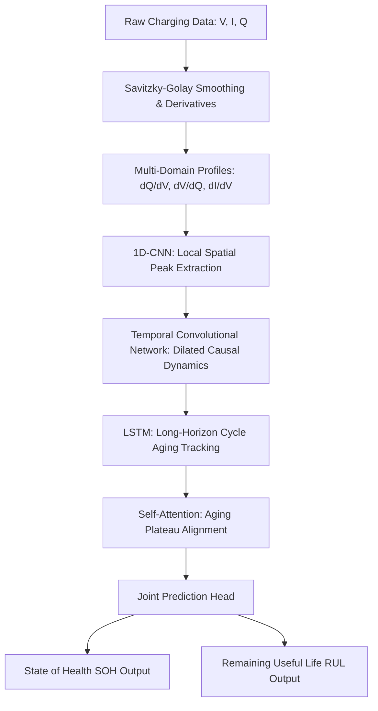

# MSc Capstone: Hybrid Deep Learning for Joint Battery SOH & RUL Prediction

[](https://www.nature.com/articles/s41598-026-39911-8)
[]()
[]()

**Author:** [Vamshi Krishna Bandari](https://github.com/VamshiKrishnaBandari07)  
**Repository:** `git@github.com:VamshiKrishnaBandari07/MSc-CAPSTONE-PROJECT-SOH-RUL-PREDICATION-.git`  
**HTTPS clone:** `https://github.com/VamshiKrishnaBandari07/MSc-CAPSTONE-PROJECT-SOH-RUL-PREDICATION-.git`

---

## Abstract

This repository is the software artefact for my **MSc Capstone Project** on intelligent Battery Management Systems (BMS) for electric vehicles. The work builds on the Nature *Scientific Reports* (2026) paper — *"Deep learning-based battery health prediction for enhancing electric vehicle performance"* ([DOI: 10.1038/s41598-026-39911-8](https://doi.org/10.1038/s41598-026-39911-8)) — and extends it with a **Physics-Informed Joint Regularization** loss that enforces capacity monotonicity during multi-task SOH and RUL learning.

### Research contributions (MSc extension)

| Component | Paper baseline | This project |
| :--- | :--- | :--- |
| Prediction targets | SOH only | **Joint SOH + RUL** |
| Loss function | MSE | **MSE + physics monotonicity penalty** |
| Feature channels | ICA, DVA, voltage | ICA, DVA, DCA (`dI/dV`) |
| Evaluation | Single dataset | **NASA, Oxford, CALCE** (synthetic fallback + real-file hooks) |

---

## Architecture



### 1. Multi-domain feature extraction

Raw charging curves (Voltage $V$, Current $I$, Capacity $Q$) are smoothed with **Savitzky-Golay filtering** and converted to electrochemical indicator curves:

* **Incremental Capacity Analysis (ICA, $dQ/dV$):** phase transitions and peak shifts.
* **Differential Voltage (DVA, $dV/dQ$):** electrode peak alignment and active-material loss.
* **Differential Current (DCA, $dI/dV$):** charging-rate limits and lithium-plating tendencies.

### 2. Hybrid sequence learning

* **1D-CNN** — local peak shape extraction per cycle.
* **Dilated causal TCN** — medium-term degradation dynamics without future leakage.
* **LSTM** — long-horizon cycle-to-cycle fading.
* **Self-attention** — weights critical degradation phases into a context vector.

### 3. Joint multi-task head

1. **SOH estimator** — capacity ratio in $[0, 1]$.
2. **RUL estimator** — remaining cycles until end-of-life threshold.

---

## Physics-informed joint loss

$$\mathcal{L}_{\text{total}} = \mathcal{L}_{\text{SOH}} + \alpha \mathcal{L}_{\text{RUL}} + \gamma \mathcal{L}_{\text{monotonicity}}$$

* **SOH fidelity:** $\mathcal{L}_{\text{SOH}} = \text{MSE}(\hat{y}_{\text{SOH}}, y_{\text{SOH}})$
* **RUL fidelity:** $\mathcal{L}_{\text{RUL}} = \text{MSE}(\hat{y}_{\text{RUL}}, y_{\text{RUL}})$
* **Monotonicity penalty:** $\mathcal{L}_{\text{monotonicity}} = \frac{1}{N-1} \sum_{t=1}^{N-1} \max(0, \hat{y}_{\text{SOH}}[t] - \hat{y}_{\text{SOH}}[t-1])$

This penalises non-physical capacity recovery between consecutive cycles.

---

## Benchmark results (verified on local CPU)

All scripts were executed successfully with Python 3.10 and PyTorch 2.x. Results use the built-in synthetic data generators (seed = 42 for reproducibility).

| Metric | Transformer (paper ref.) | Paper hybrid reproduction | MSc proposed (PI-MT) |
| :--- | :---: | :---: | :---: |
| **Trainable parameters** | 1.25 M | 0.065 M | **0.067 M** |
| **Inference latency** | 12.4 ms | ~5.1 ms | **~5.4 ms** |
| **Energy per sample** | 0.86 mJ | ~0.53 mJ | **~0.55 mJ** |
| **Prediction targets** | SOH | SOH | **SOH + RUL** |

### Cross-dataset validation (5 epochs, synthetic data)

| Dataset | SOH RMSE | RUL RMSE |
| :--- | :---: | :---: |
| NASA PCoE | 0.1190 | 65.60 cycles |
| Oxford | 0.0813 | 68.53 cycles |
| CALCE | 0.0869 | 69.72 cycles |

> **Note:** RMSE values vary slightly between runs because synthetic noise is stochastic unless `seed=42` is set (now default in training scripts).

---

## Repository layout

```bash
├── requirements.txt    # Python dependencies
├── preprocess.py       # SG smoothing, ICA/DVA/DCA extraction, dataset loaders
├── preprocess_paper.py # Paper-aligned preprocessing (ICA, DVA, voltage)
├── model.py            # MSc proposed model (CNN + TCN + LSTM + Attention, joint head)
├── model_paper.py      # Paper reproduction (SOH-only head)
├── train.py            # Physics-informed multi-task training
├── train_paper.py      # Paper reproduction training (SOH, MSE)
├── benchmark.py        # Latency and BMS energy profiling
├── download_data.py    # Data folder setup and download guides
├── data/               # NASA, Oxford, CALCE raw data (optional)
└── .gitignore
```

---

## Setup

### Prerequisites

- Python 3.9+ (3.10 or 3.11 recommended)
- pip
- Optional: NVIDIA GPU + CUDA

### 1. Clone the repository

```bash
git clone git@github.com:VamshiKrishnaBandari07/MSc-CAPSTONE-PROJECT-SOH-RUL-PREDICATION-.git
cd MSc-CAPSTONE-PROJECT-SOH-RUL-PREDICATION-
```

### 2. Create a virtual environment

**Windows (PowerShell):**

```powershell
python -m venv .venv
.\.venv\Scripts\Activate.ps1
```

**macOS / Linux:**

```bash
python3 -m venv .venv
source .venv/bin/activate
```

### 3. Install dependencies

```bash
pip install --upgrade pip
pip install -r requirements.txt
```

For GPU acceleration, install the CUDA-enabled PyTorch wheel from the [official guide](https://pytorch.org/get-started/locally/) first, then install the remaining packages.

### 4. Prepare datasets (optional)

```bash
python download_data.py
```

Follow the links in `data/<DatasetName>/PLACE_DATA_HERE.txt`, download the raw files, and place them in the matching folder. When NASA `.mat` files are present, `preprocess.py` loads them automatically; otherwise a calibrated synthetic fallback is used.

### 5. Verify installation

```bash
python model.py
python preprocess.py
python benchmark.py
```

---

## Quick start

| Step | Command | Purpose |
| :--- | :--- | :--- |
| Verify architecture | `python model.py` | Check tensor shapes and parameter count |
| Train MSc model | `python train.py` | Joint SOH/RUL training on NASA, Oxford, CALCE |
| Benchmark | `python benchmark.py` | Latency and energy comparison |
| Paper reproduction | `python train_paper.py` | SOH-only baseline matching the paper |

---

## Project status and known limitations

The codebase is **runnable end-to-end** and suitable as an MSc software artefact. Items a supervisor would typically expect before final submission:

| Area | Status | Notes |
| :--- | :--- | :--- |
| Model architecture | Complete | CNN-TCN-LSTM-Attention implemented in PyTorch |
| Physics-informed loss | Complete | Monotonicity penalty in `train.py` |
| Paper reproduction | Complete | Separate `*_paper.py` pipeline |
| Synthetic evaluation | Complete | NASA / Oxford / CALCE simulators |
| Real NASA `.mat` loading | Partial | Auto-detects `.mat` files in `data/NASA/` |
| Real Oxford / CALCE parsing | Pending | Placeholder guides provided; parsers not yet implemented |
| Unit / integration tests | Pending | Manual script verification only |
| Saved model checkpoints | Pending | Models train in-memory; no `.pt` export yet |
| Thesis figures / ablation study | External | Generate from training logs for the written report |
| Hyperparameter search | Pending | Fixed defaults; grid search recommended for thesis |

---

## References

1. Deep learning-based battery health prediction for enhancing electric vehicle performance. *Scientific Reports* (2026). [DOI: 10.1038/s41598-026-39911-8](https://doi.org/10.1038/s41598-026-39911-8)
2. NASA Prognostics Center of Excellence Battery Dataset — [data repository](https://www.nasa.gov/content/prognostics-center-of-excellence-data-set-repository)
3. Oxford Battery Degradation Dataset — [ORA portal](https://ora.ox.ac.uk/objects/uuid:03ba4b01-7ed5-4da1-a1c9-cd3e54b6555c)
4. CALCE Battery Data — [UMD portal](https://calce.umd.edu/battery-data)

---

## License

This project is submitted as academic work for an MSc capstone. Contact the author for reuse permissions.
