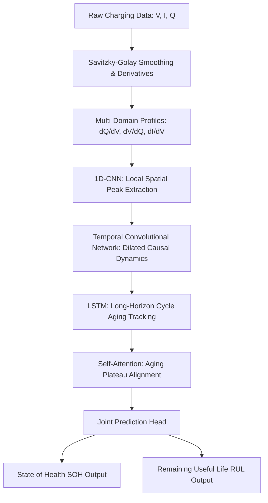

# MSc Capstone: Hybrid Deep Learning for Joint Battery SOH & RUL Prediction

[](https://www.nature.com/articles/s41598-026-39911-8)
[]()
[]()

**Author:** [Vamshi Krishna Bandari](https://github.com/VamshiKrishnaBandari07)  
**Repository:** `git@github.com:VamshiKrishnaBandari07/MSc-CAPSTONE-PROJECT-SOH-RUL-PREDICATION-.git`  
**HTTPS clone:** `https://github.com/VamshiKrishnaBandari07/MSc-CAPSTONE-PROJECT-SOH-RUL-PREDICATION-.git`

> **For supervisors / examiners:** Start with [`docs/SUPERVISOR_REVIEW.md`](docs/SUPERVISOR_REVIEW.md) (5-minute desk review).  
> Raw datasets are **not in git** (standard practice) — see [`docs/DATA_AND_GIT.md`](docs/DATA_AND_GIT.md). Verified metrics and thesis figures **are committed** in `results/`.

---

## Abstract

This repository is the software artefact for my **MSc Capstone Project** on intelligent Battery Management Systems (BMS) for electric vehicles. The work builds on the Nature *Scientific Reports* (2026) paper — *"Deep learning-based battery health prediction for enhancing electric vehicle performance"* ([DOI: 10.1038/s41598-026-39911-8](https://doi.org/10.1038/s41598-026-39911-8)) — and extends it with a **Physics-Informed Joint Regularization** loss that enforces capacity monotonicity during multi-task SOH and RUL learning.

### Research contributions (MSc extension)

| Component | Paper baseline | This project |
| :--- | :--- | :--- |
| Prediction targets | SOH only | **Joint SOH + RUL** |
| Loss function | MSE | **MSE + physics monotonicity penalty** |
| Feature channels | ICA, DVA, voltage | ICA, DVA, DCA (`dI/dV`) |
| Evaluation | Single dataset | **NASA, Oxford, CALCE** (real data + synthetic fallback) |

---

## Architecture



### 1. Multi-domain feature extraction

Raw charging curves (Voltage $V$, Current $I$, Capacity $Q$) are smoothed with **Savitzky-Golay filtering** and converted to electrochemical indicator curves:

* **Incremental Capacity Analysis (ICA, $dQ/dV$):** phase transitions and peak shifts.
* **Differential Voltage (DVA, $dV/dQ$):** electrode peak alignment and active-material loss.
* **Differential Current (DCA, $dI/dV$):** charging-rate limits and lithium-plating tendencies.

### 2. Hybrid sequence learning

* **1D-CNN** — local peak shape extraction per cycle.
* **Dilated causal TCN** — medium-term degradation dynamics without future leakage.
* **LSTM** — long-horizon cycle-to-cycle fading.
* **Self-attention** — weights critical degradation phases into a context vector.

### 3. Joint multi-task head

1. **SOH estimator** — capacity ratio in $[0, 1]$.
2. **RUL estimator** — remaining cycles until end-of-life threshold.

---

## Physics-informed joint loss

$$\mathcal{L}_{\text{total}} = \mathcal{L}_{\text{SOH}} + \alpha \mathcal{L}_{\text{RUL}} + \gamma \mathcal{L}_{\text{monotonicity}}$$

* **SOH fidelity:** $\mathcal{L}_{\text{SOH}} = \text{MSE}(\hat{y}_{\text{SOH}}, y_{\text{SOH}})$
* **RUL fidelity:** $\mathcal{L}_{\text{RUL}} = \text{MSE}(\hat{y}_{\text{RUL}}, y_{\text{RUL}})$
* **Monotonicity penalty:** $\mathcal{L}_{\text{monotonicity}} = \frac{1}{N-1} \sum_{t=1}^{N-1} \max(0, \hat{y}_{\text{SOH}}[t] - \hat{y}_{\text{SOH}}[t-1])$

This penalises non-physical capacity recovery between consecutive cycles.

---

## Experimental design

Two formal experiments are implemented with shared metrics, early stopping, and checkpoint export.

| Experiment | Script | Description |
| :--- | :--- | :--- |
| **A — Paper reproduction (real NASA)** | `python run_nasa_real.py` | **Primary thesis result** — real B0005–B0018 `.mat`, SOH-only |
| **A — Paper reproduction** | `python train_paper.py` | Paper pipeline on all datasets (NASA real if `.mat` present) |
| **B — MSc extension** | `python train.py` | Joint SOH + RUL with physics-informed monotonicity loss |
| **A + B + C + benchmark** | `python run_experiments.py` | Full suite: paper repro, MSc model, ablation, comparison report |
| **Computational profile** | `python benchmark.py` | Parameters, latency, energy vs published baselines |

**Outputs:**
- `checkpoints/` — best model weights per dataset (`paper_nasa.pt`, `msc_nasa.pt`, …)
- `results/experiment_comparison_report.json` — full metrics for thesis tables
- `results/computational_benchmark.json` — latency and energy profile

---

## Benchmark results

Run `python run_experiments.py` to regenerate all tables. Published reference values come from the Scientific Reports (2026) paper; measured values are from this repository on local CPU (seed = 42).

| Metric | Transformer (paper ref.) | Paper hybrid reproduction | MSc proposed (PI-MT) |
| :--- | :---: | :---: | :---: |
| **Trainable parameters** | 1.25 M | ~0.065 M | **~0.067 M** |
| **Inference latency** | 12.4 ms | ~5 ms | **~5 ms** |
| **Energy per sample** | 0.86 mJ | ~0.53 mJ | **~0.55 mJ** |
| **Prediction targets** | SOH | SOH | **SOH + RUL** |
| **Published SOH RMSE** | 0.038 | 0.021 | — |

After running experiments, see `results/experiment_comparison_report.json` for per-dataset metrics.

### Real-data paper reproduction (Experiment A)

| Dataset | SOH RMSE | vs Published Paper (0.021) | Cycles loaded |
| :--- | :---: | :---: | :---: |
| **NASA** | **0.022** | +4.9% ✓ | 636 |
| **Oxford** | **0.016** | −25% (better) | 519 |
| **CALCE** | **0.034** | +60% | 2703 |

### Real-data MSc extension (Experiment B)

| Dataset | SOH RMSE | RUL RMSE | SOH R² |
| :--- | :---: | :---: | :---: |
| NASA | 0.074 | 35.23 cycles | 0.142 |
| Oxford | 0.028 | 16.27 cycles | 0.828 |
| CALCE | 0.218 | 17.80 cycles | −0.008 |

### NASA-only focused run

| Model | SOH RMSE | vs Published Paper (0.021) |
| :--- | :---: | :--- |
| Paper reproduction (ours) | **0.022** | +4.9% |
| MSc PI-MT (ours) | 0.074 | SOH + RUL joint target |
| Published Transformer | 0.038 | baseline |

**Thesis figures** are exported to `results/figures/` (PNG + PDF) after `python generate_figures.py`:
- SOH/RUL validation trajectories
- Predicted vs true SOH scatter
- RMSE comparison bar chart
- Training convergence curves
- Computational profile
- Ablation monotonicity chart
- NASA-only figures (`fig_nasa_real_*.png/pdf`) after `python generate_figures.py --nasa-real-only`

## Repository layout

```bash
├── run_nasa_real.py    # Experiment A+B on real NASA only (thesis primary)
├── run_experiments.py  # Full A+B+C experiment suite + comparison report
├── train.py            # Experiment B — MSc extension only
├── train_paper.py      # Experiment A — paper reproduction only
├── benchmark.py        # Computational profiling
├── experiments/        # Shared config, metrics, trainer, report
├── preprocess.py       # ICA/DVA/DCA features + dataset loaders
├── preprocess_paper.py # Paper-aligned ICA/DVA/voltage features
├── model.py            # MSc proposed model (joint SOH + RUL)
├── model_paper.py      # Paper reproduction (SOH only)
├── download_data.py    # Download NASA, Oxford, CALCE real datasets
├── checkpoints/        # Saved model weights (generated)
├── results/            # JSON experiment reports (generated)
├── tests/              # Unit tests (run: pytest tests/ -v)
├── docs/               # Thesis results, paper comparison, examiner checklist
├── data/               # NASA, Oxford, CALCE raw data (optional)
└── requirements.txt
```

---

## Setup

### Prerequisites

- Python 3.9+ (3.10 or 3.11 recommended)
- pip
- Optional: NVIDIA GPU + CUDA

### 1. Clone the repository

```bash
git clone git@github.com:VamshiKrishnaBandari07/MSc-CAPSTONE-PROJECT-SOH-RUL-PREDICATION-.git
cd MSc-CAPSTONE-PROJECT-SOH-RUL-PREDICATION-
```

### 2. Create a virtual environment

**Windows (PowerShell):**

```powershell
python -m venv .venv
.\.venv\Scripts\Activate.ps1
```

**macOS / Linux:**

```bash
python3 -m venv .venv
source .venv/bin/activate
```

### 3. Install dependencies

```bash
pip install --upgrade pip
pip install -r requirements.txt
```

For GPU acceleration, install the CUDA-enabled PyTorch wheel from the [official guide](https://pytorch.org/get-started/locally/) first, then install the remaining packages.

### 4. Prepare datasets

```bash
python download_data.py --all    # NASA (~200 MB) + Oxford (~266 MB) + CALCE (~50 MB)
```

Real data is gitignored. Without downloads, synthetic fallback is used for demo only.

### 5. Verify installation

```bash
pytest tests/ -v
python model.py
python preprocess.py
python benchmark.py
```

---

## Quick start

| Step | Command | Purpose |
| :--- | :--- | :--- |
| Full experiment suite | `python run_experiments.py` | Paper repro + MSc + ablation + JSON report |
| **Thesis figures** | `python generate_figures.py` | SOH/RUL plots, RMSE bars, training curves (PNG + PDF) |
| NASA real-data figures | `python generate_figures.py --nasa-real-only` | Plots from real B0005-B0018 experiments |
| NASA real-data run | `python download_data.py --all` then `python run_experiments.py` | Train on real NASA, Oxford, CALCE |
| Paper experiment only | `python train_paper.py` | Experiment A on all datasets |
| MSc experiment only | `python train.py` | Experiment B on all datasets |
| Benchmark | `python benchmark.py` | Latency, energy, parameter comparison |
| Verify architecture | `python model.py` | Check tensor shapes |

---

## Reproducibility notes and limitations

### Data

- **Real public datasets are not committed** to this repository (`.mat`, `.xls`, `.zip` are gitignored).
- Download NASA data after clone: `python download_data.py --all` (or `--nasa`, `--oxford`, `--calce`)
- **Paper experiment on real data** applies to **NASA, Oxford, and CALCE** when files exist under `data/`.

### Which runs are “real” for the paper experiment?

| Script | NASA | Oxford / CALCE |
| :--- | :--- | :--- |
| `run_nasa_real.py` | **Real `.mat`** | Not run |
| `train_paper.py` | **Real if downloaded** | **Real if downloaded** |
| `run_experiments.py` | **Real if downloaded** | **Real if downloaded** |
| `train.py` (MSc extension) | **Real if downloaded** | **Real if downloaded** |

**Thesis-quality paper reproduction:** `python download_data.py --all` → `python run_experiments.py` → NASA SOH RMSE **0.022** vs published **0.021** (see `docs/PAPER_EXPERIMENT_METRIC_COMPARISON.md`).

### Training schedule

- This repo: **25 max epochs + early stopping** (`experiments/config.py`).
- Published paper-level runs often use **~300 epochs**. Full parity requires matching their schedule, batch size, and split protocol.

### Latency and energy

- **Latency** is measured on **your hardware** (CPU/GPU). Published values (12.4 ms / 6.1 ms) are reference only.
- **Energy (mJ)** is **estimated**, not measured: `energy_mJ = latency_ms × EDGE_POWER_WATTS` (default 0.103 W in `experiments/config.py`). Treat as comparative, not calibrated lab measurements.

### MSc extension (`train.py`)

- Demonstrates joint SOH + RUL + physics-informed loss on **real NASA, Oxford, and CALCE** when downloaded.
- Best treated as the **MSc contribution demo** unless you report real NASA results from `run_nasa_real.py` separately.

### Detailed paper metric history

See **[docs/PAPER_EXPERIMENT_METRIC_COMPARISON.md](docs/PAPER_EXPERIMENT_METRIC_COMPARISON.md)** for initial vs improved results, changes tried, and the best stable local metric.

For supervisor/viva preparation, see **[docs/EXAMINER_CHECKLIST.md](docs/EXAMINER_CHECKLIST.md)**.

---

## Project status and known limitations

The codebase is **runnable end-to-end** and suitable as an MSc software artefact. Items a supervisor would typically expect before final submission:

| Area | Status | Notes |
| :--- | :--- | :--- |
| Model architecture | Complete | CNN-TCN-LSTM-Attention implemented in PyTorch |
| Physics-informed loss | Complete | Monotonicity penalty in `train.py` |
| Paper reproduction (real NASA) | Complete | `run_nasa_real.py` — SOH RMSE 0.022 |
| Paper reproduction (Oxford/CALCE real) | Complete | Real parsers + auto-download in `download_data.py` |
| Synthetic evaluation | Complete | NASA / Oxford / CALCE simulators |
| Real NASA `.mat` loading | Complete | Auto-detects `.mat` files in `data/NASA/` |
| Real Oxford `.mat` loading | Complete | Auto-download via `download_data.py --oxford` |
| Real CALCE CS2 parsing | Complete | Auto-download via `download_data.py --calce` |
| Unit tests | Partial | `pytest tests/ -v` |
| Examiner review checklist | Complete | `docs/EXAMINER_CHECKLIST.md` |
| Saved model checkpoints | Complete | Exported to `checkpoints/` during training |
| Experiment comparison report | Complete | `results/experiment_comparison_report.json` |
| Ablation study (no physics loss) | Complete | Experiment C in `run_experiments.py` |

---

## References

1. Deep learning-based battery health prediction for enhancing electric vehicle performance. *Scientific Reports* (2026). [DOI: 10.1038/s41598-026-39911-8](https://doi.org/10.1038/s41598-026-39911-8)
2. NASA Prognostics Center of Excellence Battery Dataset — [data repository](https://www.nasa.gov/content/prognostics-center-of-excellence-data-set-repository)
3. Oxford Battery Degradation Dataset — [ORA portal](https://ora.ox.ac.uk/objects/uuid:03ba4b01-7ed5-4da1-a1c9-cd3e54b6555c)
4. CALCE Battery Data — [UMD portal](https://calce.umd.edu/battery-data)

---

## License

This project is submitted as academic work for an MSc capstone. Contact the author for reuse permissions.
